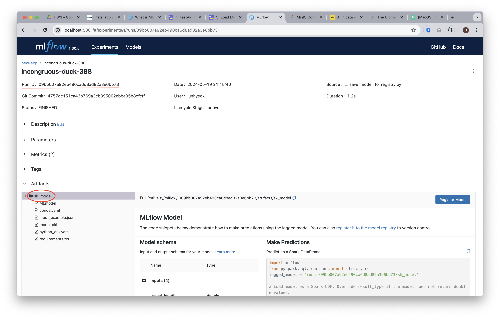

# 추가 패키지 설치

```bash
pip install boto3==1.26.8 mlflow==1.30.0
```

# 실행

```bash
docker compose up -d
```

```bash
python save_model_to_registry.py --model-name "sk_model"
```

```bash
python load_model_from_registry.py --model-name "sk_model" --run-id "RUN_ID"
```

- [MLflow 서버](http://localhost:5001/) 에 접속하여 저장된 모델의 run 을 클릭하여 run_id 와 model_name 을 확인합니다.

<div align="center">
  
</div>

# 접속

- MLflow 서버: http://localhost:5001/
- MinIO 서버: http://localhost:9001/
