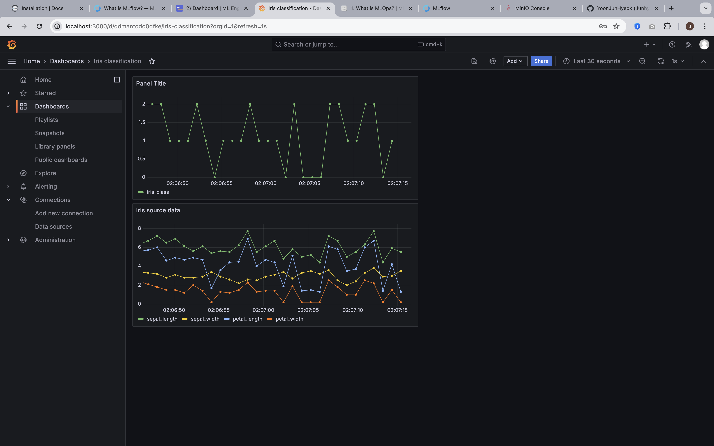

# 1. 추가 패키지 설치

```bash
pip install kafka-python requests
```

# 2. Data Subscriber 서비스 생성

```bash
docker compose -p stream -f stream-docker-compose.yaml up -d
```

# 3. Grafana Dashboard 생성

```bash
docker compose -p dashboard -f grafana-docker-compose.yaml up -d
```

<div align="center">
  
</div>
